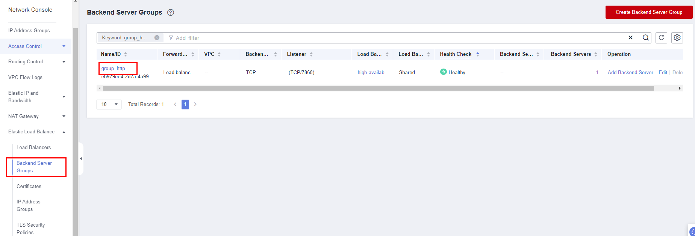

[TOC]

**Solution Overview**
===============
This solution helps you use Stable Diffusion to build high-availability Artificial Intelligence-Generated Content (AIGC) web applications on Huawei Cloud Elastic Cloud Server (ECS). Stable Diffusion is a latent text-to-image diffusion model capable of generating photo-realistic images given any text and images input.

For details about this solution, visit https://www.huaweicloud.com/solution/implementations/building-high-availability-aigc-applications-with-stable-diffusion.html

**Architecture**
---------------


**Architecture Description**
---------------
The following resources are required for deploying this solution:

1. Two GPU-accelerated Linux ECSs, which will be used for running AIGC applications

2. Three Elastic IP addresses (EIPs), which will be bound to the two Linux ECSs and an Elastic Load Balance (ELB), respectively, for internal and external communication

3. An ELB, which will be used to distribute traffic across availability zones (AZs)

4. Security group, which will be used to control traffic to and from ECSs

5. An Object Storage Service (OBS) bucket, which will be used to store generated image files

6. Stable Diffusion web UI, inotify-tools, and OBS obsutil, which will be installed on each Linux ECS to automatically upload the images saved on the web UI
**File Structure**
---------------
``` lua
huaweicloud-solution-building-high-availability-aigc-applications-with-stable-diffusion
├──huaweicloud-solution-building-high-availability-aigc-applications-with-stable-diffusion.tf.json -- Resource orchestration template
├── userdata
    ├──  aigc-applications.sh -- Script configuration file
```
**Getting Started**
---------------
1. Log in to the ELB console and choose **Backend Server Groups** from the left navigation pane. Click the target backend server group name to view its details. On the **Backend Servers** tab, check whether servers are in the **Healthy** state. (Service initialization will be completed 20 minutes after this solution is deployed based on default settings. All backend servers will be healthy on port 7860 then.)

    Figure 1  Backend server group
    

    Figure 2 Backend server status

    

2. Access the AIGC web UI using http://*EIP bound to the ELB*:7860/. Click **txt2img**, input text in the box, and click **Generate**. After the image is generated, click **Save**. For details about how to use the Stable diffusion web UI, see [stable-diffusion-webui](https://github.com/AUTOMATIC1111/stable-diffusion-webui) or search for tutorials on the Internet. This solution creates the user **aigc** with the default password **aigc@123**.

    Figure 3 AIGC web UI

    

    ```
Example text prompt:
Arches National Park,under the rock,in the evening,nightsky,reality infused with dreams,upscaled,triadic color scheme,epic composition,CG digital rendering,Studio Ghibli,unreal engine,atmospheric,omit the people
```
3. On the OBS console, click the created OBS bucket to view the saved images. You can also click **Share** to share the images. For more OBS functions, see [Object Management](https://support.huaweicloud.com/intl/en-us/ugobs-obs/obs_41_0014.html).

    Figure 4 OBS bucket list

    

    Figure 5 Viewing the saved images

    

    Note: This solution has added inotify-tools and OBS obsutil to run automatically at startup in ECSs, so the images you saved on the web UI can be automatically uploaded to the OBS bucket. You can also right-click on the web UI and choose **Save as** to save the images locally. AIGC can run automatically at ECS startup.

    ```
Example command for starting AIGC:
Start in the foreground:
cd /home/aigc && sudo -u aigc bash -c "source /home/aigc/webui.sh --listen --port 7860"
Start in the background:
cd /home/aigc && sudo -u aigc bash -c "source /home/aigc/webui.sh --listen --port 7860 &" >> /home/aigc/aigc-applications.log (change the storage path as needed)
```